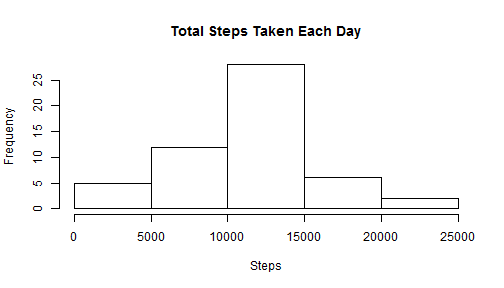
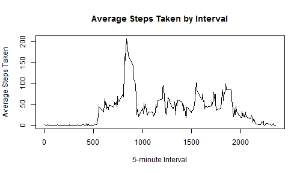
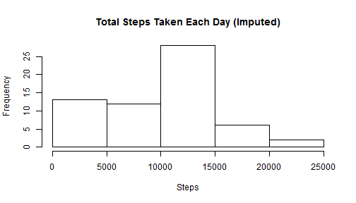
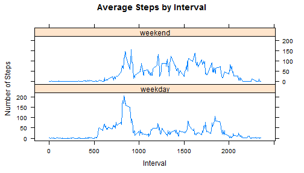

Peer Assignment 1
========================================================

## Introduction

It is now possible to collect a large amount of data about personal movement using activity monitoring devices such as a Fitbit, Nike Fuelband, or Jawbone Up. These type of devices are part of the "quantified self" movement - a group of enthusiasts who take measurements about themselves regularly to improve their health, to find patterns in their behavior, or because they are tech geeks. But these data remain under-utilized both because the raw data are hard to obtain and there is a lack of statistical methods and software for processing and interpreting the data.

This assignment makes use of data from a personal activity monitoring device. This device collects data at 5 minute intervals through out the day. The data consists of two months of data from an anonymous individual collected during the months of October and November, 2012 and include the number of steps taken in 5 minute intervals each day.


## Data

The data for this assignment can be downloaded from the course web site:

- Dataset: [Activity monitoring data](https://d396qusza40orc.cloudfront.net/repdata%2Fdata%2Factivity.zip) [52K] 

The variables included in this dataset are:

- steps: Number of steps taking in a 5-minute interval (missing values are coded as NA)

- date: The date on which the measurement was taken in YYYY-MM-DD format

- interval: Identifier for the 5-minute interval in which measurement was taken

The dataset is stored in a comma-separated-value (CSV) file and there are a total of 17,568 observations in this dataset.


## Assignment

This assignment will be described in multiple parts. You will need to write a report that answers the questions detailed below. Ultimately, you will need to complete the entire assignment in a single R markdown document that can be processed by knitr and be transformed into an HTML file.

Throughout your report make sure you always include the code that you used to generate the output you present. When writing code chunks in the R markdown document, always use echo = TRUE so that someone else will be able to read the code. This assignment will be evaluated via peer assessment so it is essential that your peer evaluators be able to review the code for your analysis.

For the plotting aspects of this assignment, feel free to use any plotting system in R (i.e., base, lattice, ggplot2)

Fork/clone the [GitHub repository created for this assignment](http://github.com/rdpeng/RepData_PeerAssessment1). You will submit this assignment by pushing your completed files into your forked repository on GitHub. The assignment submission will consist of the URL to your GitHub repository and the SHA-1 commit ID for your repository state.

NOTE: The GitHub repository also contains the dataset for the assignment so you do not have to download the data separately.


__*The tasks tackled to answer the questions are documented below:*__

* * *

### Loading and preprocessing the data

#### 1. Load the data (i.e. read.csv())

set working directory

```r
setwd("C:/Users/0648/Desktop/R")
```

load the csv file downloaded

```r
data <- read.table("./data/activity.csv",sep=",",header=TRUE,stringsAsFactors=FALSE,colClasses=c("numeric","character","numeric"),na.strings="NA")
```


#### 2. Process/transform the data (if necessary) into a format suitable for your analysis

convert "date" attribute from character to date type

```r
data$date <- as.Date(data$date,"%Y-%m-%d")
```


### What is mean total number of steps taken per day?

For this part of the assignment, you can ignore the missing values in the dataset.

#### 1. Make a histogram of the total number of steps taken each day

aggregate the total number of steps taken each day

```r
data.a <- aggregate(steps~date,data=data,FUN=sum)
```

create a histogram of the total number of steps taken each day

```r
with(data.a,(hist(steps,main="Total Steps Taken Each Day",xlab="Steps")))
```

 


#### 2. Calculate and report the mean and median total number of steps taken per day

calculate the mean of total number of steps taken per day

```r
mean(data.a$steps)
```

```
## [1] 10766
```

calculate the mean of total number of steps taken per day

```r
median(data.a$steps)
```

```
## [1] 10765
```


### What is the average daily activity pattern?

#### 1. Make a time series plot (i.e. type = "l") of the 5-minute interval (x-axis) and the average number of steps taken, averaged across all days (y-axis)

calculate the average number of steps taken across all days

```r
data.a2 <- aggregate(steps~interval,data=data,FUN=mean)
```

make a time series plot for the average number of steps taken by 5-minute interval

```r
plot(data.a2$interval,data.a2$steps,
     type="l",
     main="Average Steps Taken by Interval",
     xlab="5-minute Interval",
     ylab="Average Steps Taken")
```

 


#### 2. Which 5-minute interval, on average across all the days in the dataset, contains the maximum number of steps?

find the specific 5-minute interval containing the maximum number of steps

```r
data.a2[which.max(data.a2$steps),]
```

```
##     interval steps
## 104      835 206.2
```


### Imputing missing values

Note that there are a number of days/intervals where there are missing values (coded as NA). The presence of missing days may introduce bias into some calculations or summaries of the data.

#### 1. Calculate and report the total number of missing values in the dataset (i.e. the total number of rows with NAs)


```r
sum(is.na(data$steps))
```

```
## [1] 2304
```


#### 2. Devise a strategy for filling in all of the missing values in the dataset. The strategy does not need to be sophisticated. For example, you could use the mean/median for that day, or the mean for that 5-minute interval, etc.

calculate the median of steps for each interval

```r
data.a3 <- aggregate(steps~interval,data=data,FUN=median)
```

create a merged data set containing the original steps values and the median steps derived from the previous steps (joining on interval)

```r
data.i <- merge(data,data.a3,by.x="interval",by.y="interval",all.x=TRUE)
```

restructure the new data frame to replace the NAs in steps with the imputed values of median steps 

```r
data.i$steps <- data.i$steps.x
data.i[which(is.na(data.i$steps.x)),]$steps <- data.i[which(is.na(data.i$steps.x)),]$steps.y
```


#### 3. Create a new dataset that is equal to the original dataset but with the missing data filled in.


```r
data.new <- data.i[,c(5,3,1)]
```


#### 4. Make a histogram of the total number of steps taken each day and Calculate and report the mean and median total number of steps taken per day. Do these values differ from the estimates from the first part of the assignment? What is the impact of imputing missing data on the estimates of the total daily number of steps?

aggregate the total number of steps taken each day

```r
data.new.a <- aggregate(steps~date,data=data.new,FUN=sum)
```

create a histogram of the total number of steps taken each day

```r
with(data.new.a,(hist(steps,main="Total Steps Taken Each Day (Imputed)",xlab="Steps")))
```

 

calculate the mean for the total number of steps taken per day

```r
mean(data.new.a$steps)
```

```
## [1] 9504
```

calculate the median for the total number of steps taken per day

```r
median(data.new.a$steps)
```

```
## [1] 10395
```

compare the results between original and the new imputed data sets

```r
comparison <- data.frame(original=c(mean(data.a$steps),median(data.a$steps)),imputed=c(mean(data.new.a$steps),median(data.new.a$steps)),row.names=c("mean","median"))
comparison$diff <- comparison$imputed-comparison$original
comparison
```

```
##        original imputed  diff
## mean      10766    9504 -1262
## median    10765   10395  -370
```


### Are there differences in activity patterns between weekdays and weekends?

For this part the weekdays() function may be of some help here. Use the dataset with the filled-in missing values for this part.

#### 1. Create a new factor variable in the dataset with two levels - "weekday" and "weekend" indicating whether a given date is a weekday or weekend day.

set locale to English

```r
Sys.setlocale(category = "LC_TIME", locale = "C")
```

create a new variable "weekday" denoting weekday

```r
data.new$weekday <- weekdays(data.new$date)
```

create a new factor variable "type" with two levels \- "weekday" and "weekend" based on the value in "weekday" variable

```r
data.new$type <- "weekday"
data.new[data.new$weekday %in% c("Saturday","Sunday"),]$type <- "weekend"
data.new$type <- factor(data.new$type,levels=c("weekday","weekend"))
```

reset locale to default

```r
Sys.setlocale(category = "LC_ALL", locale = "")
```


#### 2. Make a panel plot containing a time series plot (i.e. type = "l") of the 5-minute interval (x-axis) and the average number of steps taken, averaged across all weekday days or weekend days (y-axis). The plot should look something like the following, which was creating using simulated data:


*Your plot will look different from the one above because you will be using the activity monitor data. Note that the above plot was made using the lattice system but you can make the same version of the plot using any plotting system you choose.*


calculate the average number of steps across all weekday days and weekend days

```r
data.new.a2 <- aggregate(steps~interval+type,data=data.new,FUN=mean)
```

create a panel plot containing a time series plot of the 5-minute interval and the average number of steps taken, averaged across all weekday days or weekend days

```r
library(lattice)
xyplot(steps~interval|type,data=data.new.a2,
       type="l",
       layout=c(1,2),
       xlab="Interval",
       ylab="Number of Steps",
       main="Average Steps by Interval")
```

 


